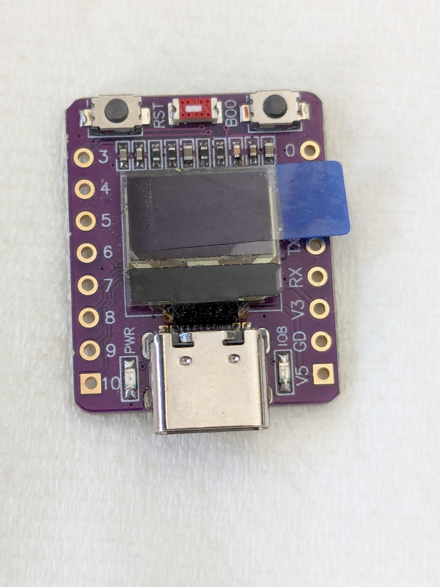

## ABrobot ESP32-C3 Mini 72x40 OLED



What happens when you do this on an ESP32-C3 board with "ESP32_GENERIC_C3" firmware?

```py
from machine import I2C
i2c = I2C(0)
```

You will probably will get a hang.

The ESP32-C3 supports only one hardware I2C interface. And the "machine_i2c.c" uses the default pin 18 for SCL and pin 19 for SDA.

The ABrobot ESP32-С3 Mini with OLED display 72x40 pixels uses pin 5 for SDA and pin 6 for SCL.

```py
from machine import Pin, I2C
i2c = I2C(0, sda=Pin(5), scl=Pin(6), freq=400000)
```

The OLED on the board needs the support of SH1106 I2C driver. To be extra usefull for writing texts, a writer module and fonts may also be needed. In this repository I provide you with a prebuild firmware for the ABrobot ESP32-С3 Mini board with the necessary frozen modules for the onboard OLED display.

```py
from machine import I2C
from screen import Display

i2c = I2C(0)

display = Display(i2c)
display.contrast(255)

# This is for default 8x8 fonts
display.text("12345678",30,12)
display.text("abcdefgh",30,23)
display.text("ABCDEFGH",30,34)
display.text(">!#%&/()",30,45)
display.show()

```

The frozen modules are based on the works of:

1. Robert Hammelrath - sh1106.py https://github.com/robert-hh/SH1106
2. Peter Hinch - writer.py and fonts https://github.com/peterhinch/micropython-font-to-py

Their contributions and their tireless efforts to help the MicroPython community are very much appreciated.


